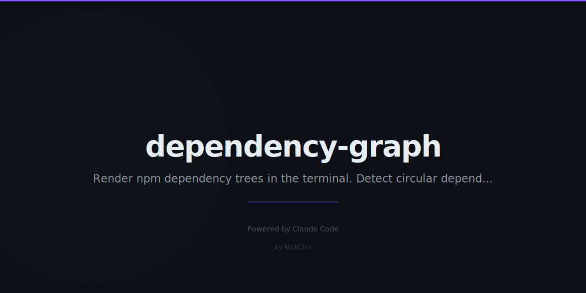

# dependency-graph

Visualize npm dependency trees as ASCII/Unicode graphs. Detect circular dependencies and version conflicts. **Zero external dependencies** — built-in Node.js modules only.

```
agent-viewer@1.0.0
├── express@4.22.1
│   ├── accepts@1.3.8
│   │   ├── mime-types@2.1.35
│   │   └── negotiator@0.6.3
│   ├── body-parser@1.20.4
│   │   ├── bytes@3.1.2
│   │   └── raw-body@2.5.2
│   └── serve-static@1.16.2
│       └── send@0.19.0
├── socket.io@4.8.1
│   ├── socket.io-adapter@2.5.5
│   └── socket.io-parser@4.2.4
└── better-sqlite3@12.6.2
    └── prebuild-install@7.1.3

  3 direct · 41 transitive · 44 total (depth ≤3)
```

## Install

```bash
npm install -g dependency-graph
```

Or run without installing:

```bash
npx dependency-graph
```

## Usage

```bash
# Show current project dependency tree
dep-graph

# Show deps of a specific package
dep-graph express

# Limit tree depth (default: 3)
dep-graph --depth 5

# Production dependencies only
dep-graph --prod

# Dev dependencies only
dep-graph --dev

# Why is a package installed? Show all dependents
dep-graph --why lodash

# Detect circular dependencies
dep-graph --circular

# Show dependency statistics
dep-graph --stats

# Flat sorted list with versions
dep-graph --flat

# JSON output (works with any flag)
dep-graph --json
dep-graph --stats --json

# Use from a different directory
dep-graph --cwd /path/to/project
```

## Features

- **ASCII/Unicode tree** — uses `├──`, `└──`, `│` box-drawing chars for clean output
- **Color coding** — blue=direct deps, white=transitive, yellow=duplicate versions, red=circular
- **Circular detection** — `--circular` finds and reports all dependency cycles
- **Version conflicts** — highlights same package required at different versions
- **`--why`** — trace all dependency chains that pull in a package
- **`--stats`** — total count, direct vs transitive, duplicates, node_modules size
- **`--flat`** — alphabetically sorted list of all resolved packages with versions
- **`--json`** — machine-readable output for any mode
- **Graceful fallback** — works without node_modules, reads from package.json
- **Zero dependencies** — uses only Node.js built-ins (fs, path, os)

## Output Modes

### Tree (default)

```
my-app@2.1.0
├── express@4.22.1
│   ├── accepts@1.3.8
│   └── body-parser@1.20.4
└── lodash@4.17.21 [duplicate]
```

### Stats (`--stats`)

```
my-app@2.1.0 — Dependency Statistics

  Direct deps:       12
  Transitive deps:   142
  Total unique:      154
  Version conflicts: 2
    lodash: 4.17.21, 4.17.11
  node_modules size: 166.8 MB
```

### Why (`--why express`)

```
Why is "express" installed?
Installed version: 4.22.1

  (root) → express
  (root) → @my/package → express
```

### Circular (`--circular`)

```
Circular Dependency Detection

Found 1 circular dependency chain(s):

  1. module-a → module-b → module-c → module-a
```

### Flat (`--flat`)

```
my-app@2.1.0 — All Dependencies (flat)

  accepts@1.3.8
  body-parser@1.20.4
  bytes@3.1.2
  express@4.22.1
  ...

  Total: 154 packages
```

## Requirements

- Node.js >= 18
- No npm install needed — zero runtime dependencies

## License

MIT
