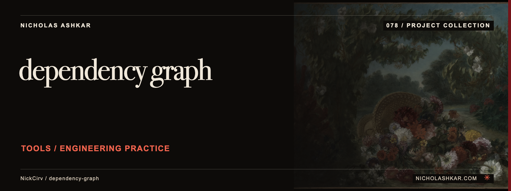

# dependency-graph

Explores an npm project's installed dependency tree and version relationships.


<a id="usage"></a>

<a id="show-dependency-tree-for-the-current-project"></a>

<a id="show-dependency-statistics-counts-conflicts-node_modules-size"></a>

## What it does

- Dependency-tree traversal.
- Version conflicts and cycles.
- Reverse dependents.
- Flat lists and package-size statistics.


<a id="install"></a>

## Quickstart

Prerequisites: Node.js `>=20` and npm. The checkout below pins the source used for this documentation.

```sh
git clone https://github.com/NickCirv/dependency-graph.git
cd dependency-graph
git checkout 74081788dcb1eb4e8f73c4b5c5c66b823c3e32e1
node index.js --json
```

**Expected behavior (illustrative, not captured):** Prints a dependency view from the current project and available installed package metadata.

Examples are source-inspected, **not runtime-tested**. See the research record for verification gaps.

## Boundaries and data

Results depend on the lockfile and node_modules state. Missing installations limit transitive detail. Its dep-graph executable alias overlaps with a separate source-import tool.


<a id="detect-circular-dependencies"></a>

## Development

The manifest defines `npm test` as:

```sh
node --test
```

The captured suite is a smoke check, not end-to-end behavior coverage. Examples include “entry is valid JavaScript”. Tests were not run for this documentation revision.

See [implementation and command reference](docs/REFERENCE.md) for the package scripts and inspected interfaces, and [research record](docs/RESEARCH.md) for the pinned source, document decisions and unresolved checks.

## License and contact

See [LICENSE](LICENSE) for the original terms and attribution. Legal text is unchanged.

[Nicholas Ashkar](https://nicholashkar.com/) · [Discuss a project](https://nicholashkar.com/#oxblood-contact)
